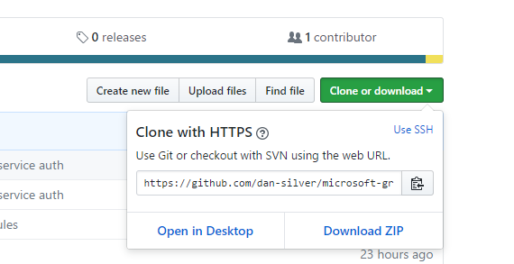
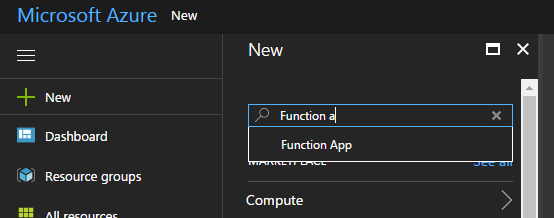
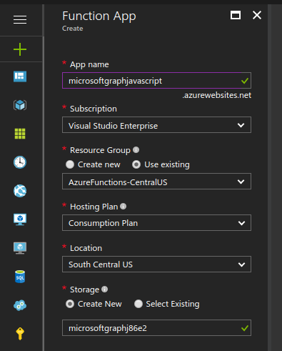
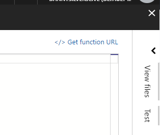

## Microsoft Graph and Azure Functions TypeScript Starter Project
This project contains a starting point for developers to deploy Microsoft Graph service apps in Azure Functions.

#### 1. Setup
* Clone this repo


* Install Node.js (if you haven't)
* ```npm install``` to install project dependencies after moving into the project directory
* ``` npm run build ``` to start TypeScript compiler and watch for changes (leave this open in another console)

#### 2. App registration

* Register your application at https://apps.dev.microsoft.com/
* Add `http://localhost:3000` as a redirect URL under Platforms -> web
* Add Application permissions (Directory.ReadWrite.All, Calendars.Read, User.ReadWrite.All, Mail.Send)
* Update `secrets.ts` with your application id
* Update `secrets.ts` with an app secret (click 'generate new password')
* Update `secrets.ts` with your tenant domain like `MOD507192.onmicrosoft.com`

#### 3. Allow your app running as a service to access Graph

* Visit `https://login.microsoftonline.com/common/adminconsent?client_id=YOUR_APP_ID&state=12345&redirect_uri=http://localhost:3000` and grant the app access. Replace `YOUR_APP_ID`. After granting access you will be redirected to `localhost:3000` and nothing is running there, which is expected.

#### 4. Deploy to Azure Functions

* Create an Azure function app at https://portal.azure.com and create a new 'Function App'


* You may need to setup credentials under `Platform Features / Code Deployment / Deployment Credentials`
* Configure your app to allow Git deployments
   * Under `Platform features` select `Deployment Options` and choose `Local Git Repository` as the source.
* Add your Function as a git remote
   * Under `General Settings` -> `Properties`, select your `Git Url`
   * `git remote add azure YOUR_GIT_URL`
* Push a deployment
  * (Make sure TypeScript recompiled after you updated your secrets file with npm run build. You should be seeing messages like 'Compilation complete' when you save the .ts files.)
  * `git add .`, `git commit -m 'Initial commit'`, `git push azure master` 

#### 5. Verify deployment and run the function!
* Since this starter project uses an HTTP trigger function, you can get a URL to execute your code. Click `Get function URL`, and open in a new tab. You can find this link by expanding the Functions panel in the left sidebar and clicking on our function.



* Check the logs and your function should be running!
